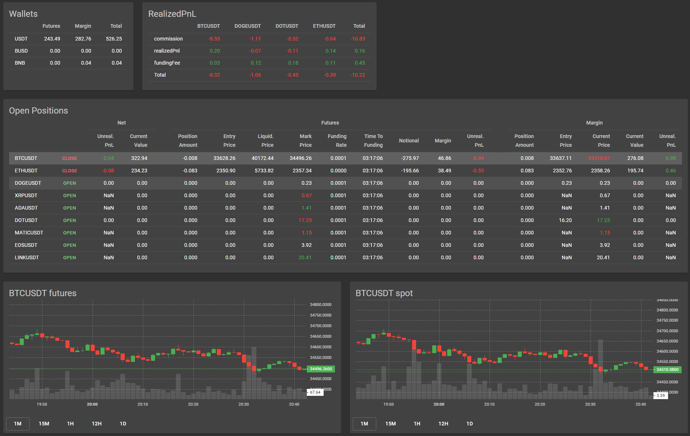
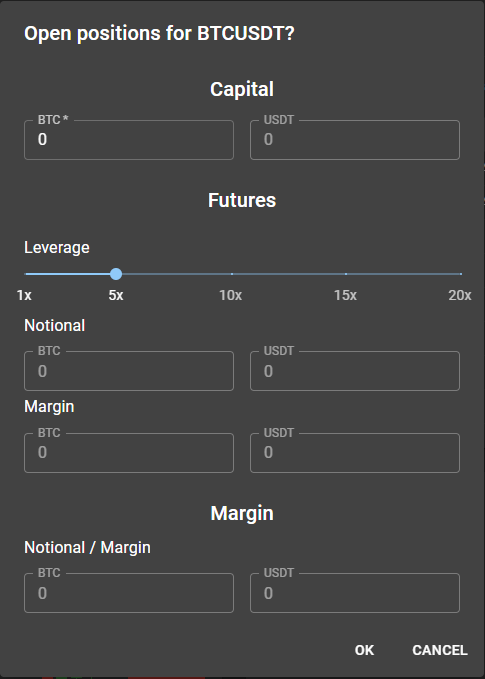
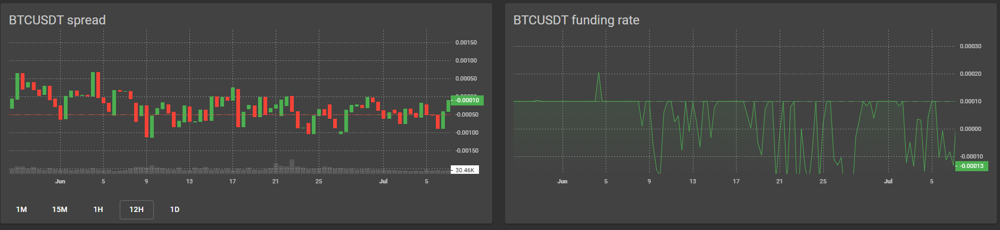
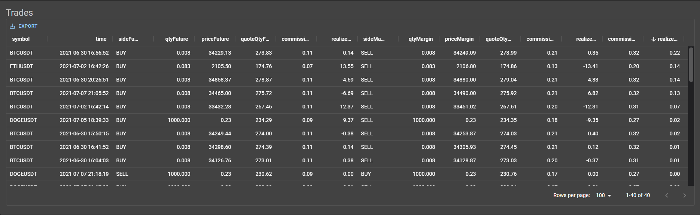

# Futures Strategy Application

This is a prototype application that is an outgrowth of a final project for a [Regression Analysis and Quantitative Trading Strategies (FINM 33150)](https://finmath.uchicago.edu/curriculum/required-courses/finm-33150/) course taken in the Spring of 2021 at the University of Chicago. [That project](https://github.com/CalebEverett/finm33150-final-project) developed a quantitative trading strategy involving perpetual futures contracts on binance.com. This application is a user interface for executing the strategy and monitoring its performance.

## Clone API repository and start server
    git clone https://github.com/CalebEverett/futures-api.git

Follow the instructions there to establish and fund margin and futures account and get api keys.

## Install Dependencies and Start Application

    yarn install
    yarn start

## Overview

The basic strategy is to establish a perpetual futures position that entitles it to receive funding rate payments every eight hours in accordance with the terms of the perpetual futures contract. An offsetting position in the underlying asset is established at the same time to avoid taking any directional risk. See the [project write up](https://github.com/CalebEverett/finm33150-final-project) for the full description.

This prototype application includes functionality to monitor market conditions to determine when they are favorable for opening and closing positions, to open and close matched positions on a market basis, and report on cumulative realized profit and loss from completed trades.

Data is initially populated from REST API endpoints and then updated on a real-time basis via websocket connections.

Currently the application is only wired up to execute trades on the binance.com exchange for the top ten futures contracts by volume, and only to establish short futures positions and long position in the associated underlying asset (the logic to establish short margin positions is slightly more complicated and historically conditions have been conducive to shorting futures much more often than going long futures).

## Components

### Wallets

Shows wallet balances excluding open positions for both the futures and the margin accounts. Updates when the application receives notifications of completed trades from [/user-stream endpoint](https://github.com/CalebEverett/futures-api/blob/b73922f84c42822be21c32d5ef0e38942c9a7a76/api/api.py#L938).

### Realized Profit and Loss

Shows the realized profit and loss for each token broken down by commission, realizedPnl and fundingFee. Commission includes commissions for both margin and futures trades. RealizedPnl includes only the difference in opening and closing price for margin and futures positions for each token. FundingFee includes futures funding rate payments for each token. Updates when the application receives notifications of completed trades from [/user-stream](https://github.com/CalebEverett/futures-api/blob/b73922f84c42822be21c32d5ef0e38942c9a7a76/api/api.py#L938) endpoint.

### Open Positions

Show position amount, entry price, current price and current value for futures and margin positions for each token. Futures information also includes margin value, liquidation price, current funding rate and time to next funding. Current prices are updated once a second from [/market-stream](https://github.com/CalebEverett/futures-api/blob/b73922f84c42822be21c32d5ef0e38942c9a7a76/api/api.py#L873) endpoint with corresponding updates to current value and realized profit and loss.

There is a trade action button in the second column that will show as green "OPEN" if no position is currently open for the given token or as red "CLOSE" if there is a position open for that token. Clicking the open button opens a dialog box to specify the parameters of the positions to open.

#### Open

A total position size is first entered in left hand box of the capital section. Leverage on the futures position can be selected wih the slider. Currently it is necessary to check to ensure that the USDT required to execute both the futures and margin positions do not exceed the balances in the wallet (to be checked automatically in the future). It is also necessary to ensure that the lot sizes of the notional amounts are consistent with binance.com's specifications for each token (also can be automatically checked via [/exchnge](https://github.com/CalebEverett/futures-api/blob/b73922f84c42822be21c32d5ef0e38942c9a7a76/api/api.py#L122) endpoint). Also note that the amount of the trades do not includes commissions. Those will be deducted from the Binance Coin (BNB) balance in the margin wallet and from the USDT balance in the futures wallet. In practice, for BTC and ETH transactions, specifying a capital amount that results in whole positions of no more than three decimal places complies with Binance's specifications. For DOGE, specifying a capital amount that results in whole number notional positions works.

Once notional amounts and USDT requirements have been specified, clicking OK will execute the trades on binance. Open positions, wallet balances and realized profit and loss components will all be updated when the application receives notifications that the trades have been completed via the [/user-stream](https://github.com/CalebEverett/futures-api/blob/b73922f84c42822be21c32d5ef0e38942c9a7a76/api/api.py#L938) endpoint.

#### Close

Clicking on the red "CLOSE" button bring up a simple confirmation dialog box. Clicking OK closes the open futures and margin positions for the associated token.

### Charts

Includes candlestick charts for each of the futures and spot prices as well as the spread between the two. Updates every second from websocket endpoints. The mouse wheel and clicking and dragging control the scale. The buttons at the bottom determine the interval of the candlesticks, ranging from one minute to one day. Changes in time scale are debounced and then applied to all of the charts to keep them in sync.

There is also a chart for funding rates that works the same way. This chart is not updated on a real time basis since funding rates update only every eight hours.

### Trades

The trades table includes one row for each pair of trades to open or close a position, including time, side, quantity, price, quote quantity (USDT value of trade), commission and realized profit and loss, with Futures or Margin appended to the column label to indicate market.

The column labels include buttons for filtering and sorting. The EXPORT button in the upper left can be used to export trades to csv.

## Implementation Details

The application is written in [React](https://reactjs.org/docs/create-a-new-react-app.html) using the [material-ui](https://material-ui.com/) component library. The charts are created with [lightweight-charts](https://github.com/tradingview/lightweight-charts) from [TradingView](https://www.tradingview.com/HTML5-stock-forex-bitcoin-charting-library/).

The application utilizes a centralized [store](https://github.com/CalebEverett/futures-app/blob/master/src/store/Store.js) to make it easier to manage the sharing of price position and position data across components. Instead of using a full [redux](https://redux.js.org/) implementation, it uses [useContext](https://reactjs.org/docs/hooks-reference.html#usecontext) and [useReducer](https://reactjs.org/docs/hooks-reference.html#usereducer) hooks to achieve similar functionality with less boilerplate.

## Future Enhancements

* Tests
* Automatically check wallet balances to determine maximum possible size of positions that can be opened
* Open positions short in the margin account and long in the futures account
* Open and close positions algorithmically
* Graphical representation of realized profit and loss over time
* Graphical representation of executed trades
* Other exchanges
* Application generated id to match margin and futures trades to filter out other trading activity in the accounts

